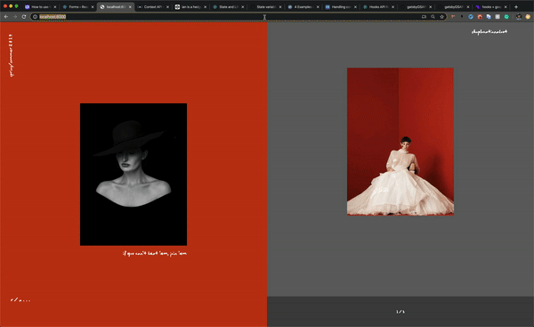

>A conceptual project attempting to use hooks and context as a global animation controller that actions and controls the animations of components from a global function instead of individually within the component.

##The goal here is to encapsulate the burried animation instructions into a semantic global state.

*As of now components LeftSlide and RightSlide's animation timelines are both being built and triggered off of the global AnimationTimeline Context: [here](https://github.com/colinnielsen/gatsbyGSAPLandingPage/blob/master/animationTimeline/AnimationTimeline.js)

*The animationTimeline context 'provider' is wrapped around the whole application and the actual timeline is being rendered in as a null return child component on the index page: [here](https://github.com/colinnielsen/gatsbyGSAPLandingPage/blob/master/src/pages/index.js)

*The rough draft of a animated child tied to the context and it's parameters can be found: [here](https://github.com/colinnielsen/gatsbyGSAPLandingPage/blob/master/src/components/RightSlide.js)

Output:

###TODOs
* Change appraoch to use component 'refs' in order to access each component's specific timeline object.
* Optimize each component to clean-up unnecessary memory usage after unmount
